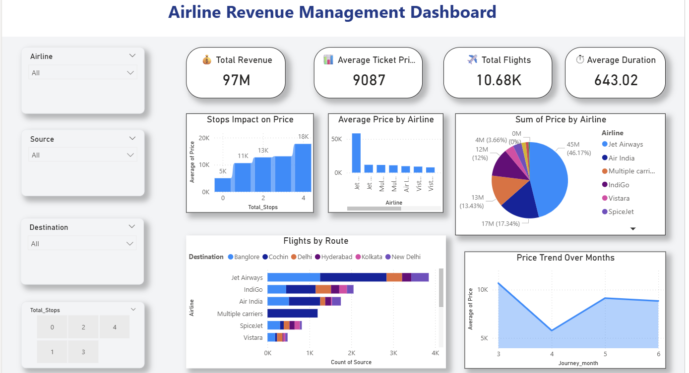

# Airline Revenue Management Dashboard

## Overview

Developed an interactive Power BI dashboard to analyze airline revenue, booking trends, occupancy rates, and operational KPIs.

## Tools & Technologies

- Power BI
- Python
- Pandas
- NumPy
- Jupyter Notebook
- Excel/CSV

## Features

- Revenue Analysis
- Booking Trend Analysis
- Route Performance Tracking
- KPI Monitoring
- Interactive Filters & Visualizations

## Data Preprocessing

Performed data cleaning and preprocessing using Python, Pandas, and Jupyter Notebook before dashboard development.

## Dashboard Preview

### Dashboard Overview

## Key Insights

- Identified high-revenue routes.
- Analyzed booking trends across time periods.
- Monitored operational KPIs for decision support.
